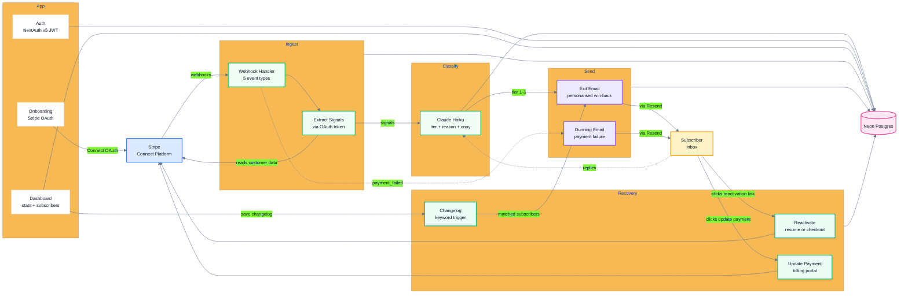

# Winback Architecture

```mermaid
%%{init: {'theme': 'base', 'themeVariables': { 'primaryColor': '#3b82f6', 'primaryTextColor': '#0f172a', 'lineColor': '#64748b', 'fontSize': '13px' }}}%%

flowchart LR
  %% === Left column: Stripe ===
  STRIPE["Stripe\nConnect Platform"]

  %% === Webhook + Processing ===
  subgraph INGEST[" Ingest "]
    direction TB
    WEBHOOK["Webhook Handler\n5 event types"]
    EXTRACT["Extract Signals\nvia OAuth token"]
    WEBHOOK --> EXTRACT
  end

  subgraph BRAIN[" Classify "]
    direction TB
    LLM["Claude Haiku\ntier + reason + copy"]
  end

  subgraph OUTBOUND[" Send "]
    direction TB
    EXIT_EMAIL["Exit Email\npersonalised win-back"]
    DUNNING_EMAIL["Dunning Email\npayment failure"]
  end

  SUBSCRIBER["Subscriber\nInbox"]

  subgraph RECOVER[" Recovery "]
    direction TB
    REACTIVATE["Reactivate\nresume or checkout"]
    UPDATE_PAY["Update Payment\nbilling portal"]
    CHANGELOG["Changelog\nkeyword trigger"]
  end

  %% === Bottom: persistence ===
  DB[("Neon Postgres")]

  %% === Top: UI ===
  subgraph UI[" App "]
    direction TB
    AUTH["Auth\nNextAuth v5 JWT"]
    ONBOARD["Onboarding\nStripe OAuth"]
    DASHBOARD["Dashboard\nstats + subscribers"]
  end

  %% === Main pipeline: left to right ===
  STRIPE -- "webhooks" --> WEBHOOK
  EXTRACT -- "signals" --> LLM
  LLM -- "tier 1-3" --> EXIT_EMAIL
  WEBHOOK -. "payment_failed" .-> DUNNING_EMAIL
  EXIT_EMAIL -- "via Resend" --> SUBSCRIBER
  DUNNING_EMAIL -- "via Resend" --> SUBSCRIBER

  %% === Recovery: subscriber acts ===
  SUBSCRIBER -- "clicks reactivation link" --> REACTIVATE
  SUBSCRIBER -- "clicks update payment" --> UPDATE_PAY
  REACTIVATE --> STRIPE
  UPDATE_PAY --> STRIPE

  %% === Changelog trigger ===
  DASHBOARD -- "save changelog" --> CHANGELOG
  CHANGELOG -- "matched subscribers" --> EXIT_EMAIL

  %% === Reply loop ===
  SUBSCRIBER -. "replies" .-> LLM

  %% === OAuth ===
  ONBOARD -- "Connect OAuth" --> STRIPE
  EXTRACT -- "reads customer data" --> STRIPE

  %% === DB: single lines per group ===
  INGEST --> DB
  LLM --> DB
  OUTBOUND --> DB
  RECOVER --> DB
  AUTH --> DB
  DASHBOARD --> DB

  %% === Styling ===
  classDef stripe fill:#dbeafe,stroke:#3b82f6,stroke-width:2px,color:#0f172a
  classDef process fill:#f0fdf4,stroke:#22c55e,stroke-width:2px,color:#0f172a
  classDef email fill:#ede9fe,stroke:#8b5cf6,stroke-width:2px,color:#0f172a
  classDef recover fill:#ecfdf5,stroke:#10b981,stroke-width:2px,color:#0f172a
  classDef db fill:#fce7f3,stroke:#ec4899,stroke-width:2px,color:#0f172a
  classDef user fill:#fef3c7,stroke:#f59e0b,stroke-width:2px,color:#0f172a
  classDef ui fill:#fff,stroke:#e2e8f0,stroke-width:1px,color:#0f172a

  class STRIPE stripe
  class WEBHOOK,EXTRACT process
  class LLM process
  class EXIT_EMAIL,DUNNING_EMAIL email
  class SUBSCRIBER user
  class REACTIVATE,UPDATE_PAY,CHANGELOG recover
  class DB db
  class AUTH,ONBOARD,DASHBOARD ui
```
