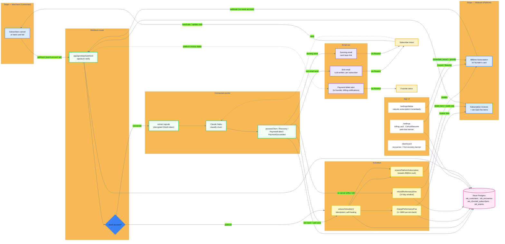

# Winback Architecture

Updated 2026-04-27 — reflects the post-billing-rewrite system (PRs #35–#39
plus Phase D hardening). Two Stripe accounts now: the customer's *Connected*
account (where subscribers live) and Winback's own *Platform* account (where
the founder is billed via Stripe Subscription).

## Key flows

**1. Voluntary cancellation → win-back**
Subscriber cancels on the merchant's Stripe → connected webhook → `processChurn` classifies and sends an LLM-written exit email → subscriber clicks the reactivate link → connected webhook fires `customer.subscription.created` → `processRecovery` records a `win_back` recovery → `ensureActivation` charges 1× MRR (bundled onto the $99/mo subscription's first invoice if this is the first delivery, or onto the next cycle's invoice if already active).

**2. Failed payment → card save**
Stripe Smart Retries on the merchant's Connected account fails → connected webhook fires `invoice.payment_failed` → `processPaymentFailed` sends a dunning email with an update-payment link → subscriber updates card → `invoice.payment_succeeded` → `processPaymentSucceeded` records a `card_save` recovery → `ensureActivation` ensures the platform subscription exists but charges no per-recovery fee.

**3. Re-cancel within 14 days → automatic refund**
A previously-recovered subscriber cancels again → connected webhook fires `customer.subscription.deleted` → `maybeRefundRecentWinBack` finds the recovery within the window → `refundPerformanceFee` either deletes the pending invoice item (pre-finalize) or issues a credit note (post-paid).

**4. Founder-side billing**
First save or win-back triggers activation. Stripe Subscription drives all subsequent monthly billing, dunning, and retries. The founder can `Cancel` or `Resume` from `/settings`. If a platform charge fails, `processPlatformInvoiceEvent` logs the event and `sendPlatformPaymentFailedEmail` notifies the founder so they can update their card.
