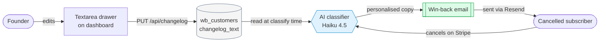
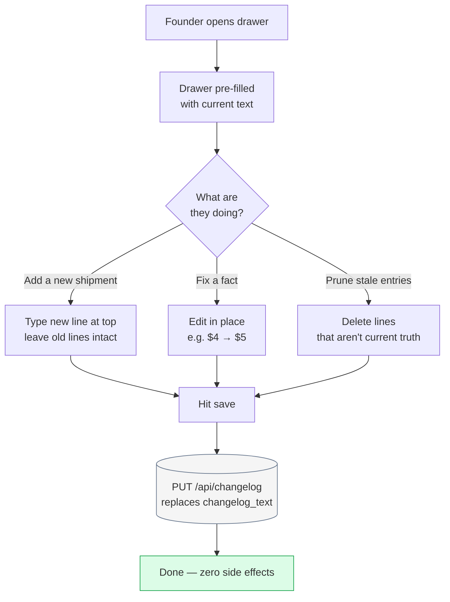
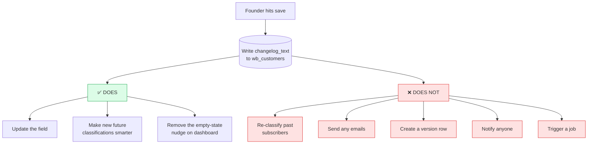
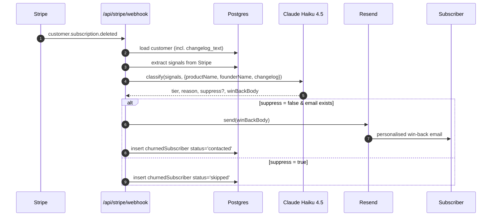
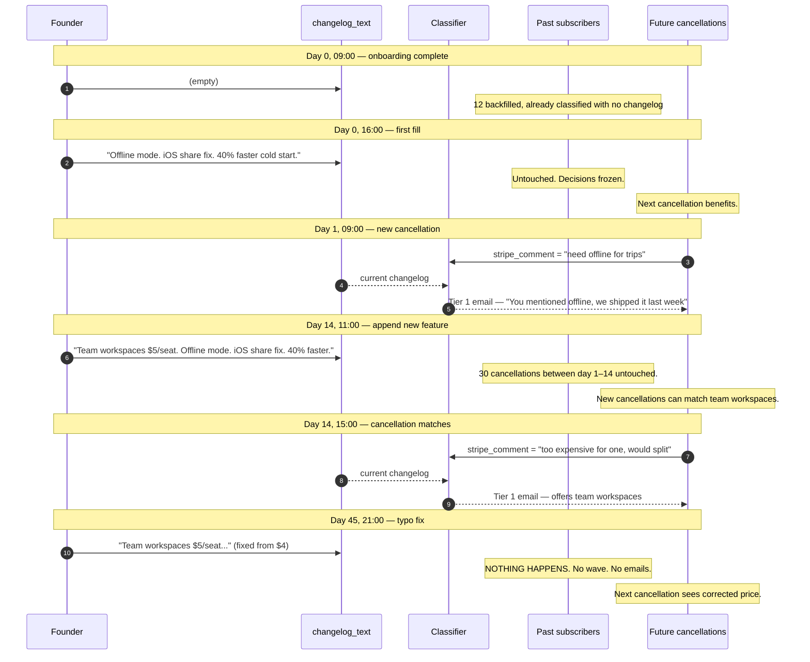
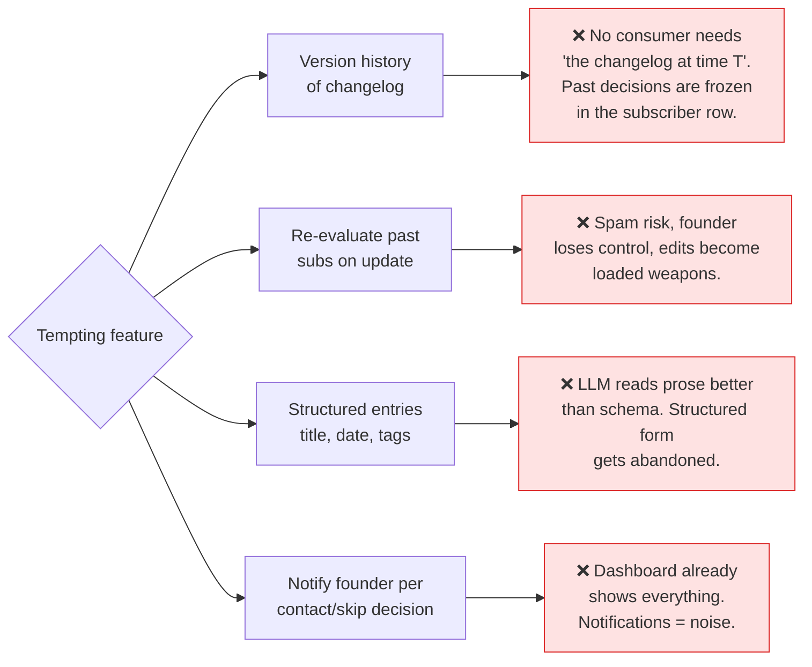
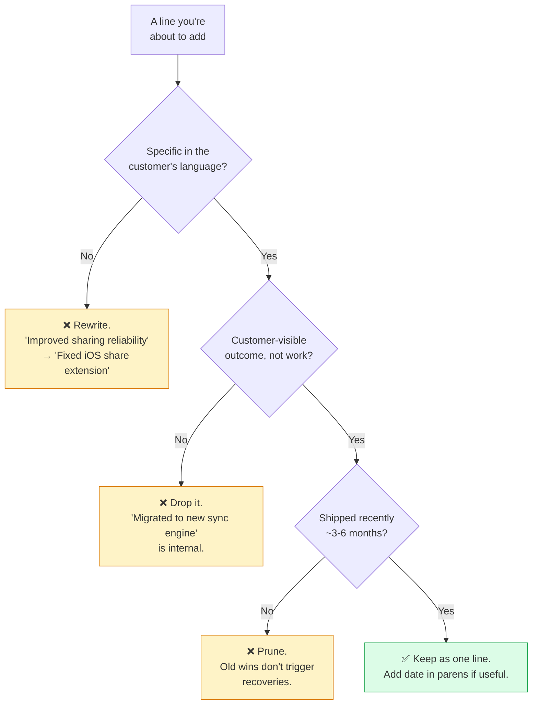
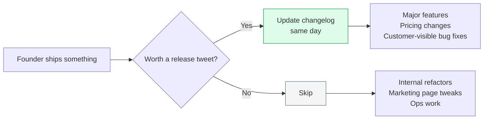
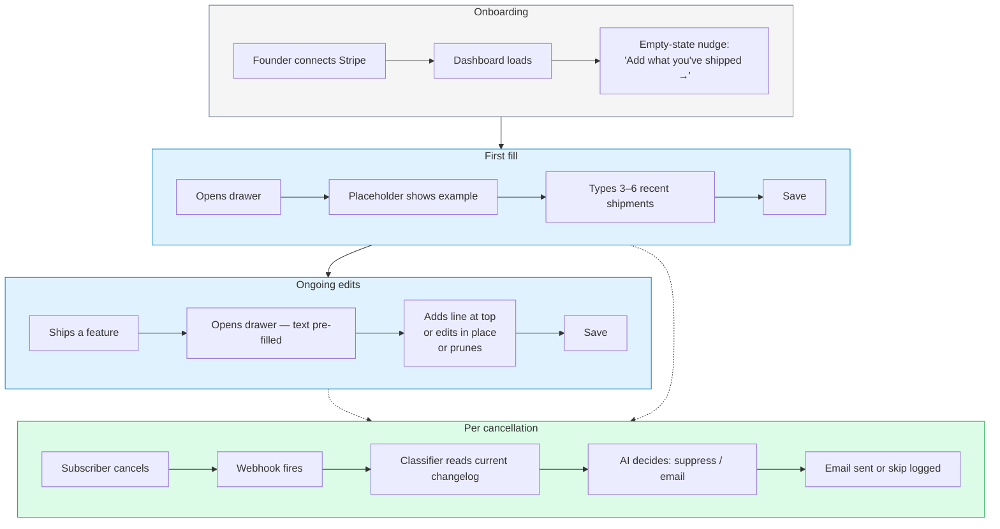

# Changelog — how it works

A visual walkthrough of how the changelog field flows through the system,
when it's read, when it's written, and — critically — what it does *not*
trigger.

---

## 1. The big picture

One textarea. One column. Read at classification time. Never retroactive.

---

## 2. Founder update — three patterns, one mechanic

Every save is a full overwrite of `changelog_text`. The founder's behaviour
varies; the system's behaviour doesn't.

**Key point:** the *mechanic* is always "overwrite." The *behaviour* the
founder adopts is "edit a living doc." They add, correct, and prune — they
don't start from scratch, and they don't append forever.

---

## 3. What a save does and does NOT do

The single most important diagram in this doc. Every "No" is what keeps the
product simple and prevents spam.

---

## 4. The read path — what happens on a new cancellation

This is the only place `changelog_text` is consumed. Every cancellation
event pulls the *current* changelog and hands it to the AI.

The changelog is read in step 2 (customer load) and consumed in step 4
(classify). It has no role after the email is sent.

---

## 5. Time-ordered example — founder updates over 45 days

Concrete walkthrough of three updates and what each one actually changes.
Read top-to-bottom.

---

## 6. Why no versioning, no re-evaluation

Explicit rejection of four common temptations, with the reason each is out.

---

## 7. Content guidance — what makes a good changelog entry

**Target length:** 200–800 chars sweet spot. Cap ~2000. Soft character
counter in the UI guides the founder; no hard limit.

---

## 8. Cadence — when to update

Expected rhythm: one bulk fill at onboarding (last 3 months of shipments),
then a quick edit every 1–4 weeks as they ship.

---

## 9. The complete lifecycle on one page

Dotted arrows mean "independent — happens whenever a cancellation occurs,
not triggered by the edit."

---

## Recap in one sentence

**The founder edits a living doc; the system reads it at classification
time; nothing retroactive ever happens.** Everything else in this file is a
consequence of those three rules.
